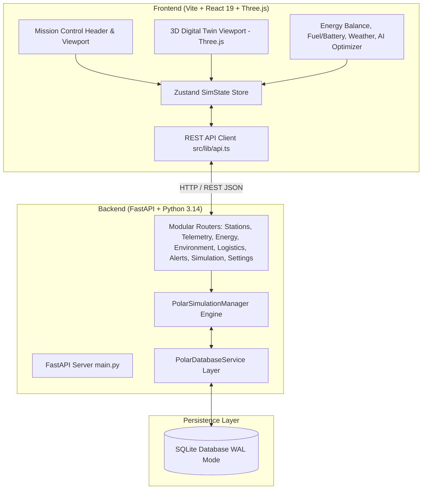

# NOVARA | Antarctic Digital Twin - System Architecture

**Product:** NOVARA | Antarctic Digital Twin  
**Target Organization:** Ministry of Earth Sciences (MoES) / National Centre for Polar and Ocean Research (NCPOR)  
**Target Stations:** Maitri Station (Schirmacher Oasis) & Bharati Station (Larsemann Hills)  

---

## 1. High-Level Architecture Overview

NOVARA is structured as a decoupled, modern digital twin platform:

---

## 2. Backend Design & Modular Layering

The backend avoids monolithic single-file designs by separating concerns into distinct layers:

### A. Routers (`backend/routers/`)
- `station_router.py`: Station profiles, geographic coordinates, building 3D footprints, and equipment inventories.
- `telemetry_router.py`: Real-time sensor snapshots, 24h/48h historical trends, and power balance breakdowns.
- `energy_router.py`: Diesel generator remote dispatching (G1, G2) and priority load shedding controls (P2 habitat, P3 auxiliary).
- `environment_router.py`: Synoptic Automatic Weather Station (AWS) observations and weather presets.
- `logistics_router.py`: Consumable stock accounting (fuel ATF, food, medicine, reagents, spares) and resupply timelines.
- `alerts_router.py`: Operational alarms and lifecycle state management (trigger, acknowledge, dismiss, clear).
- `simulation_router.py`: Fault injection, scenario presets, clock speed multipliers, and system resets.
- `settings_router.py`: Operator console preference persistence.

### B. Domain Models & Schemas (`backend/models/schemas.py`)
- Strictly validated with Pydantic v2.
- Enforces typing, boundaries, and validation errors returning standardized `422 Unprocessable Entity` envelopes.

### C. Simulation Physics Engine (`backend/services/simulation_manager.py`)
- Thread-safe simulation state using `threading.RLock()`.
- Deterministic electro-thermal modeling:
  - **Solar PV generation**: Depends on polar solar elevation angles and atmospheric optical depth.
  - **Wind turbines**: Katabatic wind velocity response with high-speed cut-out feathering (>25 m/s).
  - **Thermal demand**: Heating demand scales dynamically as outside temperature drops.
  - **BESS LiFePO4 battery**: State of charge (SoC) buffering and inverter safety cutoffs.
  - **Fuel consumption**: Specific fuel consumption model for Arctic/Antarctic diesel generators.

### D. Persistence Layer (`backend/database/`)
- SQLite running in **WAL (Write-Ahead Logging)** mode for high-concurrency read/write transactions.
- Automated migrations (v1 and v2) and baseline device seedings.

---

## 3. Frontend Design & Mission Control UI

### Visual & Stylistic Principles
- **Color Palette**: Strictly adheres to the polar mission-control palette:
  - Pale ice-blue workspace canvas (`#ebf5fb`)
  - Crisp white panel cards (`#ffffff`) with subtle ice borders (`#d0e1ed`)
  - Deep polar navy technical typography (`#0b2138`)
  - Electric cyan/teal primary data accents (`#009bb8`)
  - Semantic status indicators (Green nominal `#16a34a`, Amber warning `#d97706`, Red critical `#dc2626`)
- **Typography**: Clean, technical font **Plus Jakarta Sans** loaded via Google Fonts and configured globally across all headings, cards, badges, and data tables.
- **Full-Screen Viewport**: Application fills 100% of the viewport height (`h-screen`) beneath browser chrome, with all side panels scrolling internally (`min-h-0 overflow-y-auto`).

### 3D Digital Twin Simulation
- Rendered via **Three.js** and `@react-three/fiber` / `@react-three/drei`.
- Real-time station switching between Maitri and Bharati.
- Interactive mesh raycasting: clicking buildings or equipment focuses the camera and displays engineering telemetry.

---

## 4. Boundaries & Simulation Integrity
1. **Simulation Mode**: Prominently displayed across all headers, cards, and API envelopes.
2. **No False Claims**: Explicitly does not claim live satellite SCADA telemetry from physical Antarctic stations.
3. **Resilience**: The frontend functions smoothly in both connected mode (live backend sync) and offline optimistic fallback mode.
